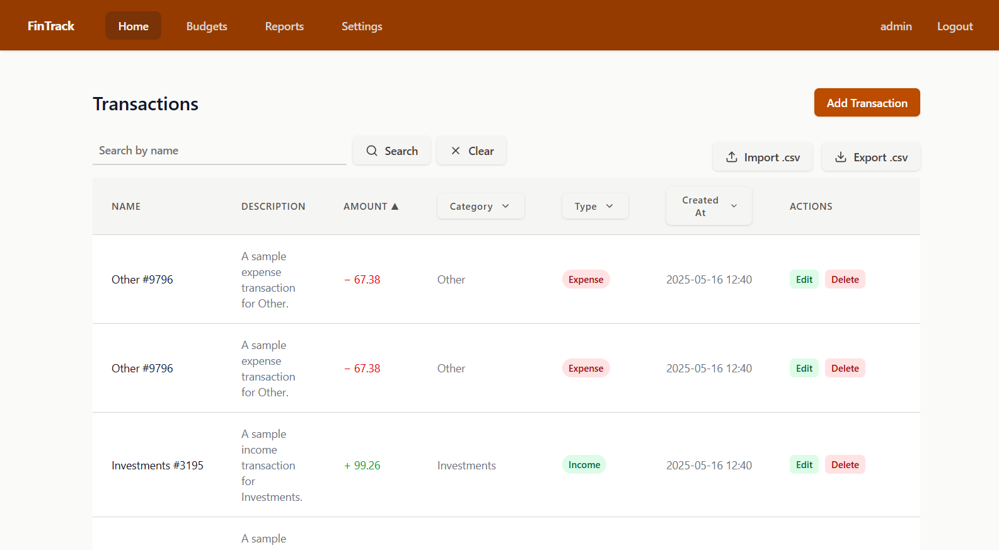
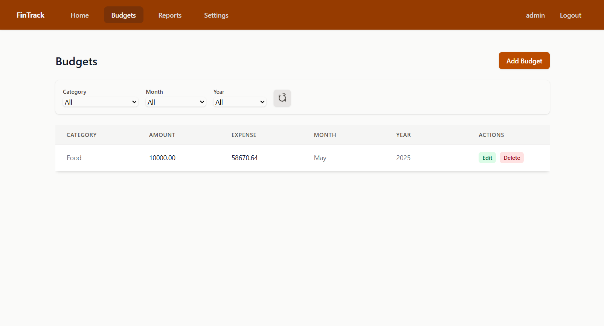
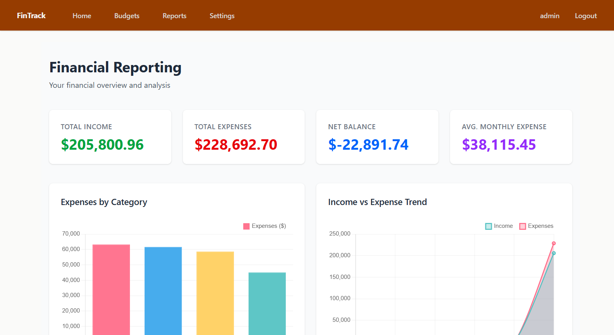

# Financial Transaction Management System

This project is a Django-based financial transaction management system designed to help users track and manage their income and expenses. It provides a user-friendly interface for recording transactions, categorizing them, and generating reports to aid in financial decision-making.

## Showcase
### Financial Transactions

### Financial Budgets

### Financial Reports

## Features

* User authentication and authorization
* Transaction recording with details such as name, description, amount, category, and type (income or expense)
* Filtering and sorting of transactions by various criteria (name, description, amount, category, type, and date)
* Generation of financial reports, including total income, total expenses, net balance, and average monthly expense
* Import and export of transactions in CSV format
* User interface for creating, updating, and deleting transactions

## Technologies Used

* Django framework for the backend
* Tailwinds, HTMX for the frontend
* CSV for data import and export
* Django's built-in authentication and authorization system for user management

## Installation and Setup

1. Clone the repository to your local machine.
2. Install the required packages by running `pip install -r requirements.txt`.
3. Run `python manage.py migrate` to apply database migrations.
4. Run `python manage.py runserver` to start the development server.
5. Access the application in your web browser at `http://localhost:8000`.

### To install sample data
1. Run `python manage.py seed_data` from a virtual environment.

## Contribution

Contributions to this project are welcome. If you'd like to contribute, please fork the repository, make your changes, and submit a pull request.
